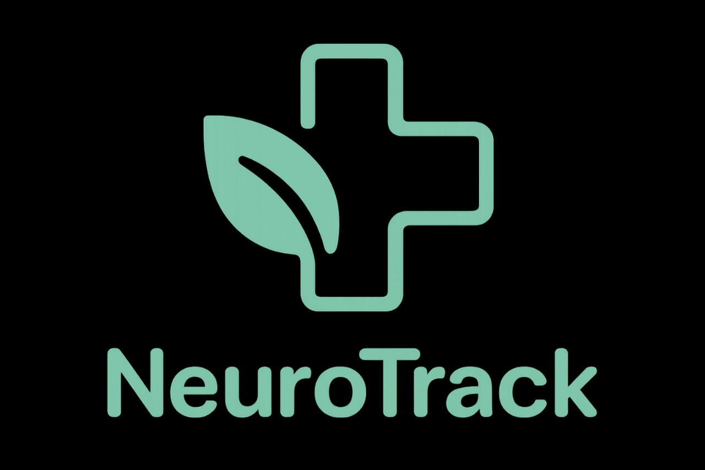

# 🩺 NeuroTrack

> **Cuide de sua saúde mental, ela realmente importa.**

O **NeuroTrack** é uma plataforma robusta de **Business Intelligence (BI)** que transforma dados de usuários em **alertes estratégicos**. Desenvolvida para prevenir burnouts e/ou situações agravantes de saúde mental, o NeuroTrack garante a apoio e esse tipo de situação.

---

## ✨ Destaques da Plataforma

| Funcionalidade | Descrição |
| :--- | :--- |
| 🚨 **Alertas Inteligentes**  | Notificações em tempo real sobre sua saúde mental. |
| 📊 **Relatórios Gerenciais** | Dashboards para acompanhamento de sua saúde mental. |

---

## 🏗️ Arquitetura e Tecnologia

O NeuroTrack adota uma arquitetura moderna e escalável, utilizando o melhor de cada tecnologia:

* **Frontend & BI:** **Oracle Apex**
* **Backend & Microserviços:** **Java** e **C#**
* **Mobile:** **React Native**
* **Banco de Dados:** **Oracle DB**
* **Cloud:** **Oracle Cloud Infrastructure**

---

## 🤝 Integrantes do Projeto

| Nome                                  | Função no Projeto          | LinkedIn | GitHub |
|---------------------------------------|----------------------------|----------|--------|
| Cleyton Enrike de Oliveira            | Desenvolvedor .NET & IOT   | [LinkedIn](https://www.linkedin.com/in/cleyton-enrike-de-oliveira99) | [@Cleytonrik99](https://github.com/Cleytonrik99) |
| Matheus Henrique Nascimento de Freitas| Desenvolvedor Mobile & DBA | [LinkedIn](https://www.linkedin.com/in/matheus-henrique-freitas)     | [@MatheusHenriqueNF](https://github.com/MatheusHenriqueNF) |
| Pedro Henrique Sena                   | Desenvolvedor Java & DevOps| [LinkedIn](https://www.linkedin.com/in/pedro-henrique-sena)          | [@devpedrosena1](https://github.com/devpedrosena1) |

---

## 🎬 Pitch
▶️ [**Assista ao vídeo da nossa solução**](https://youtu.be/jCSo9ISv7RY)

## 🎬 Vídeo Técnico
▶️ [**Assista ao vídeo da nossa solução**](https://youtu.be/jCSo9ISv7RY)

---

### 🗃️ Diagrama de Entidade-Relacionamento (DER)

<div align="center">
  
</div>

---
## ✨ Tecnologias


- **Java 21**
- **Spring Boot 3.5**
- **Spring Data JPA**
- **H2 Database** (banco de dados local para testes)
- **Oracle DB** (banco de dados real/final)
- **Maven** (gerenciador de dependências)
- **Springdoc OpenAPI** (documentação Swagger UI)
- **Docker** (microserviços)
---

---

# 🚀 Como Executar Localmente

## **Pré-requisitos**

Antes de rodar o projeto, certifique-se de ter os seguintes softwares instalados:

- **[Java 21+](https://www.oracle.com/java/technologies/javase/jdk21-archive-downloads.html)**
- **[Maven 3.9+](https://maven.apache.org/download.cgi)**

---

## **Passos para Instalação e Execução**

### 1. **Clonar o repositório**

```bash
git clone https://github.com/oraclechallenge1/Oracle-Java-Advanced.git
```

### 2. **Acesse a pasta do projeto**

```bash
cd ProjectMedSave
```

### 3. **Compile o projeto**

```bash
mvn clean install
```
### 4. **Execute o projeto**

```bash
mvn spring-boot:run
```

O projeto iniciará em:  

👉 [http://localhost:8080](http://localhost:8080)

A documentação Swagger estará disponível em:  

👉 [http://localhost:8080/swagger-ui.html](http://localhost:8080/swagger-ui.html)

---
# 🚀 Como Executar o Docker

### 1. **Dê um pull na imagem docker**

```bash
docker pull devpedrosena1/project-med-save:2.0
```

### 2. **Rode o container**

```bash
docker run -p 8080:8080 project-med-save:2.0
```

O projeto iniciará em:  

👉 [http://localhost:8080](http://localhost:8080)

A documentação Swagger estará disponível em:  

👉 [http://localhost:8080/swagger-ui.html](http://localhost:8080/swagger-ui.html)

---

## 🌐 Mapeamento de Endpoints (API REST)

Os microserviços de backend são acessados através da nossa API REST. Abaixo está o mapeamento dos principais *endpoints*.

Caso queria uma outra opção de acesso as APIs, clique no link abaixo.

"Link" é a âncora para as URIs de cada endpoint.

## UserSys ("/api/v1/user")

| Método | Endpoint                                   | Funcionalidade                                                   | URI                             |
|--------|--------------------------------------------|------------------------------------------------------------------|---------------------------------|
| GET    | `/api/v1/user`                             | Retorna todos os usuários.                                       | [Link](http://localhost:8080/api/v1/user)   |
| GET    | `/api/v1/user/{id}`                        | Retorna um usuário específico por ID.                            | [Link](http://localhost:8080/api/v1/user/2) |
| POST   | `/api/v1/user`                             | Cadastra um novo usuário.                                        | [Link](http://localhost:8080/api/v1/user)   |
| DELETE | `/api/v1/user/{id}`                        | Remove um usuário por ID.                                        | [Link](http://localhost:8080/api/v1/user/16)|
| PUT    | `/api/v1/user/{id}`                        | Atualiza um usuário específico por ID                            | [Link](http://localhost:8080/api/v1/user/2) |
| PATCH  | `/api/v1/user/{id}`                        | Atualiza parcialmente um usuário específico por ID               | [Link](http://localhost:8080/api/v1/user/2) |

```bash
{
  "name": "test",
  "email": "test12@gmail.com",
  "password": "testpassword",
  "status": "A",
  "roleId": 1,
  "limitsId": 2
}
```
Para conseguir fazer as requisições é obrigatório que o usuário esteja REGISTRADO no sistema, e após isso, faça login com e-mail e senha cadastrados. É utilizado Spring Security no projeto, e é um requisito que o usuário exista para que possa acessar as requisições. Para isso, o usuário deve acessar o Swagger e no campo "Authentication" registrar um usuário. Após isso, será gerado um token no sistema para que ele faça login, e a partir desse token o sistema entende que o usuário realmente existe.

Abaixo o exemplo da requisição:
| Método | Endpoint                                   | Funcionalidade                                                   | URI                             |
|--------|--------------------------------------------|------------------------------------------------------------------|---------------------------------|
| POST   | `/auth/register`                           | Registra um novo usuário.                                        | [Link](http://localhost:8080/auth/register)   |

```bash
{
  "name": "testando",
  "email": "teste@gmail.com",
  "password": "test21233",
  "status": "A",
  "roleId": 2,
  "limitsId": 3
}
```

| Método | Endpoint                                   | Funcionalidade                                                   | URI                             |
|--------|--------------------------------------------|------------------------------------------------------------------|---------------------------------|
| POST   | `/auth/register`                           | Registra um novo usuário.                                        | [Link](http://localhost:8080/auth/register)   |

```bash
{
  "email": "pedro@gmail.com",
  "password": "bombom123"
}
```
